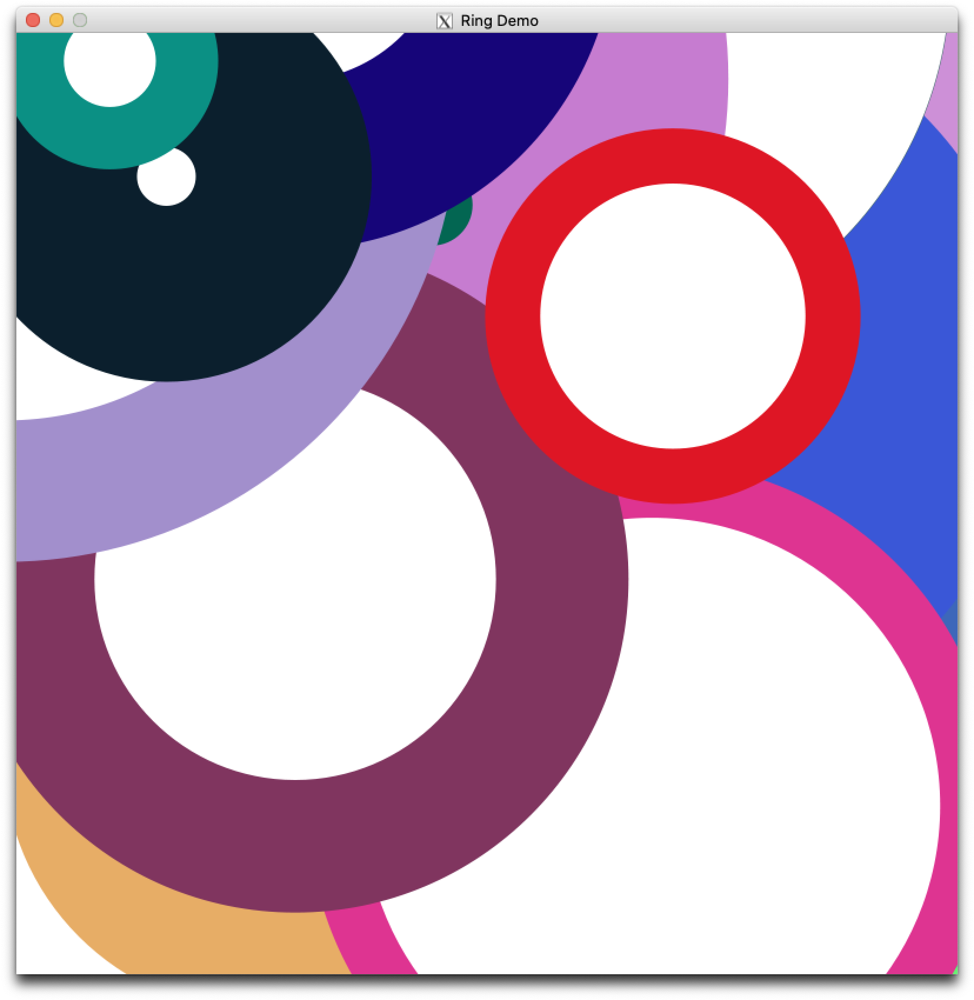
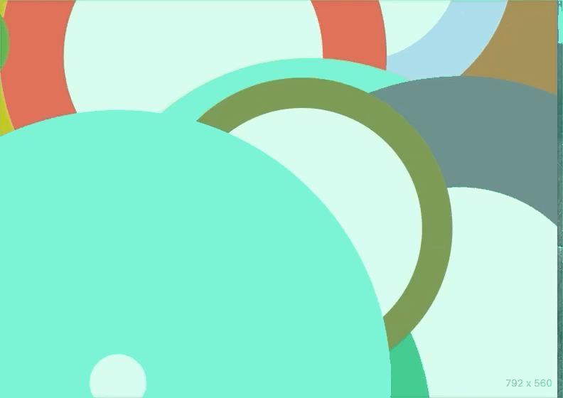

#  CSCI 1103 Computer Science I Honors

## Fall 2019

Robert Muller - Boston College

---

## Lecture Notes
## Week 4

**Topics:**

1. A Note on Simplification
2. Local Functions
3. Repetition with Images, the Animate Library
4. Record Types

---

### 1. A Note on Simplification

We've been using explicit notation for simplification with an eye toward making it easy to understand. For example, the first version of the `addList` function

```ocaml
(* addList : int list -> int
 *)
let rec addList ns =
  match ns with
  | [] -> 0
  | m :: ms -> m + addList ms
```

traced as follows

```ocaml
addList [1; 2; 3] =
  addList (1 :: [2; 3]) =>
  match (1 :: [2; 3]) with | [] -> 0 | m :: ms -> m + addList ms =>
  1 + addList [2; 3] =
  1 + addList (2 :: [3]) =>
  1 + (match (2 :: [3]) with | [] -> 0 | m :: ms -> m + addList ms) =>
  1 + (2 + addList [3]) =
  1 + (2 + addList (3 :: [])) =>
  1 + (2 + (match (3 :: []) with | [] -> 0 | m :: ms -> m + addList ms)) =>
  1 + (2 + (3 + addList [])) =>
  1 + (2 + (3 + (match [] with | [] -> 0 | m :: ms -> m + addList ms)) =>
  1 + (2 + (3 + 0)) =>
  1 + (2 + 3) =>
  1 + 5 =>
  6
```

In the above, the pair of lines

```ocaml
addList [1; 2; 3] =
  addList (1 :: [2; 3]) =>
```

didn't denote a computation step, they explicitly expressed that `[1; 2; 3]` is short-hand for the cons  `1 :: [2; 3]`. We used this explicit notation to make it easier to understand the dispatch step:

```ocaml
match (1 :: [2; 3]) with | [] -> 0 | m :: ms -> m + addList ms =>
  1 + addList [2; 3]
```

In particular, that the `1` gets plugged in for variable `m` and the list `[2; 3]` gets plugged in for variable `ms`. The explicit step-by-step notation is useful for learning about simplification. But from here on, we'll usually elide administrative steps, these usually relate to the constant factor involved in the expression of work requirements. We'll usually write the above computation more briefly as

```ocaml
addList [1; 2; 3] =>
  1 + (addList [2; 3]) =>
  1 + (2 + addList [3]) =>
  1 + (2 + (3 + addList [])) =>
  1 + (2 + (3 + 0)) =>
  1 + (2 + 3) =>
  1 + 5 =>
  6
```

With this notation, the trace of the second version of `addList`, the *work on the way in* version, becomes

```ocaml
(* addList : int list -> int -> int
 *)
let rec addList ns answer =
  match ns with
  | [] -> answer
  | m :: ms -> addList ms (m + answer)

addList [1; 2; 3] 0 =>
  addList [2; 3] (1 + 0) =>
  addList [2; 3] 1 =>
  addList [3] (2 + 1) =>
  addList [3] 3 =>
  addList [] (3 + 3) =>
  addList [] 6 =>
  6
```

Both versions require 7 computation steps but the latter is more efficient. We'll come back to this later.

### 2. Local Functions

The former version of `addList` has the virtue that it has a natural interface -- it is called with one argument, a list of integers. Unfortunately, it does its work *on the way out* so it isn't as efficient as it might be. The latter version has the virtue that it is relatively efficient. Unfortunately, it has a non-intuitive interface, the caller has to provide two input arguments when it seems just one should be required.

It isn't hard to get the best of both worlds. We can solve this problem by defining the two-argument version of the function locally within the one argument version as follows.

```ocaml
(* addList : int list -> int
*)
let addList ns =
  let rec loop ns answer =
    match ns with
    | [] -> answer
    | m :: ms -> loop ms (m + answer)
  in
  loop ns 0
```

This version has the efficiency together with the simpler user interface.

> Heads up!
>
> 1. The formal parameter for the `addList` function is named `ns`. We've felt free to recycle that name using the same variable name `ns` as one of the formal parameters of the local `loop` function. These are two different variables with the same name. This is fine.
> 2. The function `loop` is local, i.e., it is usable only within the body of the `addList` function.
> 3. Note that the `addList` function itself is not recursive so its top line doesn't require the `rec` keyword.

#### Revisiting `List.rev`

It turns out that the *work on the way in* idea can also solve the problem that we saw earlier with the quadratic work required by the simple version of the `rev` function. Recall that it was:

```ocaml
let rec rev xs =
  match xs with
  | [] -> []
  | y :: ys -> append (rev ys) [y]
```

We can do the required consing on the way in and thereby avoid calling the linear `append` function at all:

```ocaml
let rev xs =
  let rec loop xs answer =
    match xs with
    | [] -> answer
    | y :: ys -> loop ys (y :: answer)
  in
  loop xs []  
```

A brief inspection of the new implementation of `rev` shows that the `loop` function and therefore the `rev` function requires a number of computation steps that is *linear* in the length of the input list `xs`. This is a big improvement on the earlier version. On our hypothetical 1GHz computer, we've reduced our wait time for reversing a list of the 3 billion base pairs in the human genome from 31 years to 3 seconds (!).

### 3. Repetitive Images: The Animate library

Repetition is obviously one of the key concepts in computing. There are many ways to express it. In the previous section, we used *recursion* to write repetitive functions operating on lists. In the process, we learned that this is usually very natural but sometimes apparently "obvious" solutions to problems (e.g., list reversal) can lead to wildly inefficient implementations.

In this section we'll consider images that might be constructed or managed through repetitive processes. Later on we'll look at repetitive algorithms involving numbers, some for integers and some for real numbers.

We'll first consider how to construct a single, multi-part image through a call to a recursive function (left). We'll then consider how to construct an image through repeated calls to a non-recursive function (right). Both of these examples, use the `Animate.start` function and a function `randomRing : unit -> Image.t` which generates an image of a random ring, i.e., one with a random radius, a random width and a random color.

|                   |  |
| :--------------------------------------------------------: | :-----------------------------------: |
| A single image built in one shot via a repetitive process. |       An image built over time.       |

The [Animate Library](https://github.com/BC-CSCI1103/f19/blob/master/resources/libraries/animate/README.md) is documented on the course homepage. The `Animate.start` function is a recursive function accepting one required argument, the *model*, and several optional arguments:  `~name`, `~width` etc. It will call itself repeatedly until it determines that it is time to stop. In the call

```ocaml
Animate.start () ~name:"Ring Demo" ~width:800. ~height:800. ~stopWhen:finished ~viewLast:view
```

the `Animate.start` function is called with 6 inputs: `()`, `"Ring Demo"`, `800.`, `800.`, `finished` and `view`. The first argument `()` is a trivial example of a model that the application is managing. In this case, there isn't much going on so the model bears no information. The inputs `finished` and `view` are both *functions*. The former `finished : model -> bool` is a function that is called by the `Animate.start` function with the model as an input and returns `true` or `false` depending on whether or not the application is ready to continue or ready to halt. For this first example we can define this function as

```ocaml
let finished () = true
```

The function tells `Animate.start` to halt no matter what. For the `~viewLast:view` input, the `view : model -> Image.t` function will be called by the `Animate.start` function when the application has determined that it's ready to halt. It is called with the model (i.e., `()`) as input and returns an image that the `Animate.start` function will display before exiting.

Given definitions of the `displayWidth` and `displayHeight`, say something like:

```ocaml
let displayWidth  = 800.
let displayHeight = displayWidth

let empty  = Image.empty displayWidth displayHeight
```

we can then write the `randomRing` function as follows:

```ocaml
(* randomRing : unit -> Image.t *)
let randomRing () =
  let radius = (Random.float displayWidth) /. 2.0 in
  let width = Random.float radius in
  let color = Color.random () in
  let inner = Image.circle (radius -. width) Color.white in
  let outer = Image.circle radius color
  in
  Image.placeImage inner (width, width) outer
```

For the static image on the left we write a recursive function that builds the image compositionally having been prompted by a single external call:

```ocaml
(* addRings : int -> Image.t -> Image.t *)
let rec addRings n background =
  match n = 0 with 
  | true  -> background
  | false ->
    let ring = randomRing () in
    let x = (Random.float displayWidth) -. (displayWidth /. 2.0) in
    let y = (Random.float displayHeight) -. (displayHeight /. 2.0)
    in
    rings (n - 1) (Image.placeImage ring (x, y) background)
```

Then `view` can be defined simply as

```ocaml
(* view : model -> Image.t *)
let view () = addRings 100 empty
```

and finally

```ocaml
let () = Animate.start ()
           ~name: "Static Rings Demo"
           ~width: displayWidth
           ~height: displayHeight
           ~stopWhen: finished
           ~viewLast: view
```

For the "dynamic" version on the right above,  our application needs to retain both the image that is being built up as well as the number of rings that remain to be added. This suggests a model that is a pair `(count, image`)  rather than `()`. This model will be provided as input to several functions provided to `Animate.start` as input arguments.

The `Animate.start` function executes synchronously to the tick-tock of a metronome. It works in milliseconds (1000s of a second) with a default value of `1000.` (i.e., one second). The rate can be altered by providing a `~rate` argument.  Leaving out the `~name`, `~width` and `~height` inputs to save space, one can understand how `Animate.start` works given a call

```ocaml
Animate.start model ... ~onTick:update ~rate:0.1 ~view:view ~stopWhen:finished ~viewLast:viewLast
```

1. If `(finished model)` returns `true`, we're done, display the final image produced by `(viewLast model)`, then halt.
2. If `(finished model)` returns `false` then
   + display the image produced by `(view model)`;
   + set the `model` to `(update model)`
   + go to step 1.

If our model is a pair `(count, image)` then the application is finished if `count` is `0`.

```ocaml
(* finished : model -> bool *)
let finished (count, _) = count = 0
```

The `view` function is even simpler:

```ocaml
(* view : model -> Image.t *)
let view (_, image) = image
```

Finally, the `update` function needs to add one ring to the image on each clock-tick and decrement the number remaining.

```ocaml
(* update : model -> model *)
let update (count, image) = (count - 1, addRings 1 image)
```

Putting it all together, we have

```ocaml
let () = Animate.start (100, empty)
           ~name: "Dynamic Rings Demo"
           ~width: displayWidth
           ~height: displayHeight
           ~onTick: update
           ~rate: 0.01
           ~view: view
           ~stopWhen: finished
           ~viewLast: view
```

You can find the code in the `src` directory.

### 3. Record Types

As far as structured types go, we've seen tuples (of product type) and variants (of sum or either/or type) and we've seen combinations of the two as in

```ocaml
type shape = Circle of float * Color.t | Rectangle of float * float * Color.t

# let myRectangle = Rectangle (2.0, 3.0, Color.dodgerBlue);;
val myRectangle : shape = Rectangle (2.0, 3.0, Color.dodgerBlue)
```

The use of a tuple as an input to `Rectangle` is reasonable because a rectangle can be understood by its width, height and color. If we need the area of a given `shape` we can dispatch as follows

```ocml
(* area : shape -> float
*)
let area shape =
  match shape with
  | Circle(radius, color) -> Code.pi *. radius ** 2.0
  | Rectangle(width, height, color) -> width *. height
```

In this code, we've been helpful to the reader -- we've chosen good variable names `radius`, `width` and `height` in the patterns in the `match` expression. The reader can understand this code easily. Unfortunately, the same can't be said for the definition of the type `shape` above. The reader knows that the variant `Rectangle` requires two floats and a color, but the reader never knows if the float inputs are `width`, `height` or if it's `height`, `width`. We could clarify this in a comment, but comments aren't checked by the compiler so they eventually wind up being out of synch with the code. (An example of processes called *bit rot*.)

Record types let you use symbolic names for the parts of data with multiple parts. Consider a candidate for office with some number of votes and a name. We can create a record type to represent a candidate as follows:

```ocaml
# type candidate = {votes : int; name : string};;
```

A `candidate` is a tuple-like structure with exactly two *fields*: a `votes` field of type `int` and a `name` field of type `string`. Note that like a list, the fields of a record are separated by semicolons. A record can have any number of fields of any types.

```ocaml
# let buttigieg = {votes = 6000; name = "Pete Buttigieg"};;
val buttigieg : candidate = {votes = 6000; name = "Pete Buttigieg"}

# buttigieg.votes;;
- : int = 6000

# buttigieg.name;;
- : string = "Pete Buttigieg"
```

Field retrieval notation for records using the `.` is standard and can be found in a wide variety of programming languages: OCaml, JavaScript, Swift, C, Java, Rust, Go etc.

Since the fields of a record have names, the order in which they appear doesn't matter. We can swap the field order:

```ocaml
# let warren = {name = "Elizabeth Warren"; votes = 6000};;
val warren : candidate = {name = "Elizabeth Warren"; votes = 6000}
```

Records are essentially tuples with named parts. They are exceedingly useful and increasingly common in modern programming languages. A note on formatting records in CSCI 1103: when using records, we'll usually adhere to the so-called *Elm-style* with one field per line formatted as follows:

```ocaml
type candidate = { votes : int
                 ; name : string
                 }

let buttigieg = { votes = 6000
                ; name = "Pete Buttigieg"
                }
```

Please note the spacing!

#### Pattern Matching Records

The dot notation for retrieving the value of a field of a record is obviously useful. But it's more common to retrieve the values of fields of a record using pattern matching.

```ocaml
let {name = theName; votes = theVotes} = buttigieg;;
val theName : string = "Pete Buttigieg"
val theVotes : int = 6000
```

In the let form, we've used a record pattern introducing variables `theName` and `theVotes` which will hold the values of the matched fields. It turns out that in a pattern, it's OK to omit fields, the pattern will simply match whichever ones are present.

```ocaml
let {name = newName} = warren;;
val newName : string = "Elizabeth Warren"
```

Another very handy idiom is to simply *use the field name as a variable*.

```ocaml
let {name; votes} = warren;;
val name : string = "Elizabeth Warren"
val votes : int = 6000
```

It turns out that the input parameters of all function definitions are patterns.

```ocaml
(* qualifyingCandidate : candidate -> int -> bool
*)
let qualifyingCandidate {name; votes} threshold = votes > threshold
```

When specifying patterns, we don't need to specify all of the fields, only the ones of interest are required.

```ocaml
# let qualifyingCandidate {votes} threshold = votes > threshold;;
val qualifyingCandidate : candidate -> int -> bool
```

Note that OCaml can infer that the first input is of type `candidate` even though the pattern for the first input was missing the `name` filed.

Returning to the `shape` example, we might write

```ocaml
type shape = Circle of { radius : float
                       ; color  : Color.t
                       }
           | Rectangle of { width  : float
                          ; height : float
                          ; color  : Color.t
                          }
```
We often want to create a new record with field values that are identical to those of an existing record but which might have some fields with different values. In OCaml we can do this using the `with` keyword.

```ocmal
type school = MCAS | LSOE | CSON

type student = { name : string
               ; id : int
               ; classOf : int
               ; school : school
               }

# let alice = { name = "Alice"
              ; id = 555
              ; classOf = 2022
              ; school = MCAS
              };;
val alice : student = { name = "Alice"; id = 555; classOf = 2022; school = MCAS }

# let bob = { alice with name = "Bob"; id = 1000 };;
val bob : student = { name = "Bob"; id = 1000; classOf = 2022; school = MCAS }
```

Two final items worth noting:

1. record types must be explicitly defined before a record expression can be used, and
2. explicit types are required for the fields in the definition of types involving record types. In general, OCaml cannot infer these field types automatically.

> **Structured Types in Other Programming Languages**
>
> Like Java and Swift, OCaml is a *statically typed* programming language. This means that type information is associated with the symbolic names (variables, constants, etc) that appear in a program. The compiler checks these types when the program is being compiled. In *dynamically typed* programming languages like Python and JavaScript (JS), the symbolic names appearing in a program have no type information, rather, the *values* carry type information and these types are checked, not when the program is compiled, but during the *execution* of the program.
>
> This is a very fundamental difference that echos throughout the software industry. Even though OCaml is so fundamentally different that Python and JS, they share some common features. We'll touch on them here so that when you run across a Python or JS program, you'll be able to understand it more easily.
>
> **Python** has tuples and lists but it doesn't have variants or records. Python does not have a *match* (or *switch* or *case*) form but one can perform limited pattern matching with tuples and lists. For example, new variable bindings for `a`, `b` and `c` can be introduced as in
>
> ```python
> >>> (a, b, c) = (2, 'Alice', True)
> >>> b
> 'Alice'
> >>> [d, _, e] = [b, (2, 4), 2 + 3]
> >>> d
> 'Alice'
> >>> _
> (2, 4)
> ```
>
> As we noted earlier, lists in Python correspond to *arrays* in OCaml. One can write
>
> ```python
> >>> a = [10; 20; 30]
> >>> a[1]                           # pronounced "a sub 1", from position 1 of a
> 20
> ```
>
> Python doesn't have built-in syntax corresponding to OCaml lists, though one can somewhat clumsily simulate OCaml's cons operator `::` in Python using 2-tuples. For OCaml's `[2; 4; 6]`, we would write
>
> ```python
> >>> (2, (4, (6, None)))
> ```
>
> The Python *dictionary* `{'Alice' : 1, 'Bob' : 2}` has a superficial resemblance to a record, but dictionaries are actually associative arrays so they are quite different. We'll say more about this when we discuss arrays in OCaml.
>
> One of the most widely used structured data forms in Python is the *list comprehension*, an idea adopted from functional programming languages. One can write
>
> ```python
> >>> powers = range(8)
> >>> powers
> [0, 1, 2, 3, 4, 5, 6, 7]
> >>> powersOfTwo = [ 2 ** power for power in powers]    # A list comprehension
> >>> powersOfTwo
> [1, 2, 4, 8, 16, 32, 64, 128]
> ```
>
> Python's built-in `range` function is pretty handy, we've provided it in our OCaml course library `Code.range : int -> int list`.
>
> **JavaScript** doesn't have tuples or variants but it does have lists and a variation of records known as *objects*. In JS, writing
>
> ```javascript
> > (a = 2 + 2, 3 + 3, 4 + 4)
> 8
> > a
> 4
> ```
>
> I.e., what might appear to be a 3-tuple in JS is actually a sequence of 3 JS forms, each is evaluated. The value of the sequence is the value of the last expression.
>
> As in Python, JS lists are arrays.
>
> ```javascript
> > b = [1, 2, 4, 8, 16]
> [1, 2, 4, 8, 16]
>
> > b[2]                 // pronounced "b sub 2", i.e., the 2nd element of array b
> 4
> ```
>
> In JS, records are called *objects* -- the most unenlightening name ever.
>
> ```javascript
> > let warren = {name : 'Elizabeth Warren', votes : 1000}
> { name: 'Elizabeth Warren', votes: 1000 }
> ```
>
> Note the use of colon `:` rather than OCaml's equal sign `=` as a separator between the field name and its value. OCaml uses the colon in the type rather than the expression. Since JS is untyped (dynamically typed) there is no need, in fact no way, to specify the type of a record/object before creating one.
>
> Field retrieval notation for record/objects using the `.` is standard and can be found in a wide variety of programming languages: OCaml, Swift, C, Java, Rust, Go etc.
>
> ```javascript
> > warren.name
> 'Elizabeth Warren'
> ```
>
> Modern JavaScript makes heavy use of pattern matching, in JS pattern matching is called *destructuring*. One can match against both records (objects) and lists (arrays).
>
> ```JavaScript
> > let {name, votes} = warren
> > name
> 'Elizabeth Warren'
> > votes
> 1000
> > let [zero, one, , three] = [1, 2, 4, 8]
> > three
> 8
> ```
>
> The ellipsis  `...` is an especially common repetition idiom in modern JS. There are two complementary forms, one in destructuring and another in building code from variables introduced (matched) in destructuring, a process called *spreading*.
>
> When the record (object) or list (array) has multiple fields or elements, one can match a sequence of them by using the ellipsis as a prefix for a variable name as in `...xs`.
>
> ```JavaScript
> > let {first, ...rest} = {first: 10, second: 20, third: 30}
> > first
> 10
> > rest
> { second: 20, third: 30 }
>
> > let [n, ...ns] = [1, 2, 4, 8, 16]
> > n
> 1
> > ns
> [ 2, 4, 8, 16 ]
> ```
>
> The resemblance of the JS pattern `[n, ...ns]` to OCaml's cons pattern `n :: ns` is intentional, but it's important to keep in mind that OCaml's lists are not arrays. In the JS example, the variable `ns` is bound to a (shallow) *copy* of the matched list, in OCaml, `ns` is bound to the tail of the matched list, the list isn't copied.
>
> A JS variable such as `rest` or `ns` bound to a record (object) or a list (array) (resp.) can be prefixed with the ellipsis as in `...rest` or `...ns` to splice the sequence into various forms.
>
> ```JavaScript
> > {...rest, fourth: 40, fifth: 50}
> {second: 20, third: 30, fourth: 40, fifth: 50}
>
> > let override = {...rest, second: 2000}
> > override
> {second: 2000, third: 30}
>
> > [0, 1, ...ns]
> [0, 1, 2, 4, 8, 16]
>
> > [0, 1, ns]
> [0, 1, [2, 4, 8, 16]]
> ```
>
> The example shows that though `rest` had a field `second: 20`, the value of `override` is a record in which the value of the `second` field has been overridden.
>
